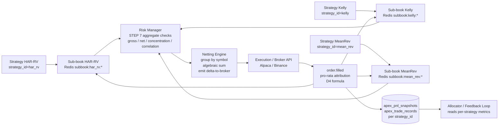

# ADR-0012 — Multi-Strategy Netting and Sub-Book Architecture

| Field | Value |
|---|---|
| Status | Proposed |
| Date | 2026-04-21 |
| Decider | Clement Barbier (CIO) |
| Supersedes | None |
| Superseded by | None |
| Related | Charter §5.5 (per-strategy identity), §5.4 (target topology), §8.2 (VETO chain); ADR-0007 §D6, §D8, §D9 (strategy as microservice); ADR-0008 (capital allocator); ADR-0014 (TimescaleDB schema v2); ADR-0013 (capital allocation trajectory, parallel PR); ADR-0006 (fail-closed risk controls) |

---

## 1. Context

Phase B of the [Multi-Strat Aligned Roadmap](../phases/PHASE_5_v3_MULTI_STRAT_ALIGNED_ROADMAP.md) introduces the first concurrent strategy microservices to APEX. Strategy #1 (`crypto_momentum`) becomes a live-micro paper strategy at the end of Phase B, joined by the transitional `LegacyConfluenceStrategy` (`strategy_id="default"`) that wraps the pre-existing confluence pipeline per [ADR-0007 §D4](ADR-0007-strategy-as-microservice.md). By Phase C the platform must sustain **two or more strategies publishing `OrderCandidate` concurrently on the same symbol universe** without the order-path machinery collapsing into either (a) first-writer-wins, (b) last-writer-wins, or (c) net-to-zero-before-attribution.

### 1.1 The collision problem

Two strategies can disagree on the same symbol at the same time, either by direction or by magnitude:

- **Directional disagreement**: `crypto_momentum` publishes an `OrderCandidate` with `direction=LONG, size=0.5 BTC` at the same tick at which a hypothetical `mean_rev_crypto` strategy publishes `direction=SHORT, size=0.3 BTC`. Both are rational intents from each strategy's thesis; both are valid in the Charter model.
- **Sizing disagreement**: two same-direction strategies publish `direction=LONG, size=0.4` and `direction=LONG, size=0.7` within the same fusion window.

If the execution path forwards both candidates to the broker unchanged, the platform incurs:

- **Double spread cost** (two round-trips instead of one net).
- **Observable cross-strategy interference** (the second strategy's fills move the book that the first strategy's remaining orders sweep through).
- **Attribution collapse** once a partial fill lands — which contributor "owns" the filled portion?
- **Risk-model incoherence** — the Risk Manager (STEP 7 `PortfolioExposureMonitor` per Charter §8.2) sees two candidates but no shared state describing their combined effect.

Conversely, if the execution path naively sums and sends only the net, the platform loses:

- **Per-strategy P&L attribution** — a single broker fill at a single price cannot by itself recover the individual strategies' intended entries.
- **Per-strategy accountability** — the feedback loop (`services/research/feedback_loop/`) cannot compute per-`strategy_id` win-rate or Sharpe, which is the load-bearing input to the allocator (ADR-0008, Charter §6).
- **Per-strategy circuit breakers** (Charter §8.1.1) — soft per-strategy drawdown triggers are meaningless if the underlying P&L is not separable by `strategy_id`.

### 1.2 Why Phase B forces the decision now

Four already-merged pieces of work make the collision problem concrete rather than theoretical:

- **PR #208** (phase-A.2, `core/models/order.py`) adds `strategy_id: str = "default"` to every order-path Pydantic model.
- **PR #213** (phase-A.3) propagates `strategy_id` from `ApprovedOrder` through `ExecutedOrder` and `TradeRecord` via `model_validator(mode="before")` hooks that **reject silent divergence** between a parent model and its nested child (see `core/models/order.py:170-201, 266-297`). A bug that would have caused two strategies' fills to accidentally carry the same `strategy_id` now raises at the model boundary.
- **PR #215** (infra, ADR-0014) adds eleven TimescaleDB hypertables — `apex_order_candidates`, `apex_approved_orders`, `apex_executed_orders`, `apex_trade_records`, `apex_pnl_snapshots`, `apex_strategy_metrics` — every one of them keyed on `strategy_id` by design (ADR-0014 §2.1). The persistence layer already assumes per-strategy attribution exists.
- **PR #214** (phase-A.8, `services/risk_manager/pnl_tracker.py`) introduces the pre-trade PnL reader with dual-key `pnl:{strategy_id}:daily` → `pnl:daily` fallback, and explicitly cites the "Millennium / Citadel pod pattern" for separating pre-trade risk from reporting paths (`pnl_tracker.py:9-12`).

The order-path contracts, the persistence schema, and the pre-trade risk readers **all already assume** that positions are tracked per `strategy_id` and that the platform is moving toward a pod model. What does not yet exist is a documented architectural contract for how per-strategy positions are held, how they flow to the single broker, how fills are attributed back, and how aggregate risk is enforced without destroying per-strategy autonomy. This ADR fills that gap.

### 1.3 Constraints from prior decisions

- [Charter §5.5](../strategy/ALPHA_THESIS_AND_MULTI_STRAT_CHARTER.md): every order-path model carries `strategy_id`; per-strategy Redis partitioning is mandatory for `kelly:{strategy_id}:{symbol}`, `trades:{strategy_id}:all`, `pnl:{strategy_id}:daily`, `portfolio:allocation:{strategy_id}`.
- [Charter §8.2](../strategy/ALPHA_THESIS_AND_MULTI_STRAT_CHARTER.md): the seven-step VETO chain has three **global** steps (STEP 0 FailClosed, STEP 1 CBEvent, STEP 2 PortfolioCircuitBreaker) and one **global aggregate** step (STEP 7 PortfolioExposureMonitor). Any aggregate risk enforcement in this ADR attaches at STEP 7, not STEP 3-6.
- [ADR-0007 §D6](ADR-0007-strategy-as-microservice.md): `strategy_id` is a first-class frozen field; `"default"` is the reserved sentinel for the legacy confluence wrap.
- [ADR-0007 §D8](ADR-0007-strategy-as-microservice.md): the Redis key namespace is already defined per-strategy for Kelly stats, trade lists, and PnL. Sub-book keys added by this ADR extend this pattern; they do not invent a new namespace.
- [ADR-0007 §D9](ADR-0007-strategy-as-microservice.md): crash isolation is at the OS level; a failure in one strategy's container does not corrupt another strategy's state.
- [ADR-0014 §2.1](ADR-0014-timescaledb-schema-v2.md): `apex_pnl_snapshots` (hourly) and `apex_strategy_metrics` (daily) are the persistence layer for the per-strategy P&L this ADR tracks in Redis as hot state. The DB tables already carry `strategy_id`; this ADR does not require any schema change.
- [ADR-0006](ADR-0006-fail-closed-risk-controls.md): STEP 0 of the VETO chain remains global and overrides per-strategy behavior.

### 1.4 Industry precedent

The user-approved approach is the **pod model** as operated at Millennium Management, Citadel, and Balyasny Asset Management. Public reporting on these firms (see §11) converges on a few consistent features:

- Each Portfolio Manager (pod) owns an independent **book** with its own P&L; evaluation is per-pod, not per-platform ([Confluence GP on Millennium's pod system](https://www.confluencegp.com/articles-and-news/millennium-s-pod-system-how-platform-design-beats-star-portfolio-managers)).
- Capital allocation is made by a central allocator on the basis of Sharpe / drawdown / factor overlap — independently of per-pod decisions ([Navnoor Bawa on Millennium structure](https://navnoorbawa.substack.com/p/millennium-managements-multi-strategy)).
- Firm-level risk groups **do not override** pod decisions at the trade level; they manage aggregate exposure by hedging or capital redeployment, preserving pod autonomy while enforcing firm-wide limits ([Citadel's Portfolio Construction & Risk Group, public reporting](https://rupakghose.substack.com/p/citadel-is-from-mars-and-millennium)).

APEX operates at a fundamentally smaller scale and with a single broker per asset class, so the architectural analogue is not one-for-one, but the three features above map cleanly:

- "Pod owns its book" → each strategy has a virtual sub-book in Redis.
- "Central allocator sets capital" → `services/portfolio/strategy_allocator/` per ADR-0008.
- "Firm risk enforces aggregate limits without overriding pod decisions" → Risk Manager STEP 7 PortfolioExposureMonitor and netting-layer circuit breakers; per-strategy intents are preserved in sub-books even when the broker sees only their sum.

Public industry sources are cited in §11; no proprietary material is used.

---

## 2. Decision

### D1 — Each strategy maintains an independent virtual sub-book in Redis

Every live strategy (`LegacyConfluenceStrategy` with `strategy_id="default"`, plus every concrete `StrategyRunner` subclass deployed per [ADR-0007 §D3](ADR-0007-strategy-as-microservice.md)) maintains an independent **virtual sub-book** keyed by its `strategy_id`. The sub-book records the strategy's intended position as if the strategy were the sole resident of the book, priced at the broker's realized fill price for each contributing fill.

The sub-book is **virtual** in one precise sense: no broker endpoint, exchange, or prime broker sees it. It is an accounting construct internal to APEX that preserves per-strategy attribution when multiple strategies share a single broker-facing net position. The broker knows only the platform's aggregate net on each symbol; the sub-books collectively re-project that net back into per-strategy components.

### D2 — Broker-facing net position is the algebraic sum of all sub-books per symbol

For every symbol, the position held at the broker is:

```
broker_net(symbol) = Σ subbook[strategy_id].position(symbol)   over all active strategy_ids
```

The execution path enforces this invariant by computing, on each new batch of approved candidates, the **delta** between the desired aggregate position (the current sub-books plus the approved deltas) and the broker's current state, and submitting only that delta to the broker. Strategies that cancel a contribution modify their own sub-book immediately; the broker-facing net is recomputed on the next cycle and the delta is submitted.

Perfectly cancelling candidates (two strategies with opposite-signed equal-magnitude intents in the same cycle) produce `delta == 0` and **no broker round-trip**. The sub-books still record the per-strategy intent at whatever mid price is chosen as the attribution reference (§D4.2).

### D3 — Risk Manager has veto authority at the aggregate level

The Risk Manager, located at `services/risk_manager/` today and migrating to `services/portfolio/risk_manager/` per [Charter §5.4](../strategy/ALPHA_THESIS_AND_MULTI_STRAT_CHARTER.md), gains a new component responsibility: aggregate-level veto informed by the full multi-strategy sub-book state.

The existing seven-step VETO chain (Charter §8.2) is preserved verbatim. Aggregate checks plug into:

- **STEP 7 `PortfolioExposureMonitor`** — already global; extended to read the full set of sub-books and to evaluate gross, net, concentration, and correlation-adjusted exposure as described in §D5.
- **STEP 3 `StrategyHealthCheck`** — per-strategy; gains a new trigger input from the per-strategy circuit breaker on `subbook:{strategy_id}:realized_pnl:daily` described in §D5.6.

No new VETO step is introduced. The Charter's seven-step topology remains canonical.

### D4 — PnL attribution is pro-rata to each contributing strategy's signed size at the fill price

When the netting engine (§D7) bundles `N` candidates into a single broker order, and the broker fills all-or-part of that order at a single price, the fill is attributed back to the `N` contributors in proportion to their **signed contribution size** as a fraction of the total signed contribution. Each contributor's sub-book is credited or debited at the broker's realized fill price, exactly as if that strategy had been executed in isolation at that price.

§D4.1 below gives the attribution formula; §D4.2 addresses partial fills; §8 gives a numeric worked example.

#### D4.1 — Attribution formula (all-or-nothing fill)

Given a netted broker order with contributors `C = [(sid_1, signed_size_1), ..., (sid_N, signed_size_N)]` and a full fill at price `P_fill`:

```
For each contributor (sid_k, signed_size_k):
    subbook[sid_k].position(symbol) += signed_size_k
    subbook[sid_k].realized_pnl_delta = 0       # no pnl until exit
    subbook[sid_k].unrealized_pnl     = mark(position, P_current) - cost_basis
    subbook[sid_k].cost_basis        += signed_size_k * P_fill
```

The sub-book stores each strategy's intent at the broker's realized fill price. When the strategy later exits, realized PnL is attributed to that `strategy_id` exactly as in a single-strategy book.

#### D4.2 — Partial fills

If the broker fills only a fraction `f ∈ (0, 1)` of the aggregate order, the fraction is applied **uniformly** to every contributor's signed size:

```
For each contributor (sid_k, signed_size_k):
    attributed_size_k = f * signed_size_k    # preserves direction sign
    subbook[sid_k].position(symbol) += attributed_size_k
    subbook[sid_k].cost_basis       += attributed_size_k * P_fill
```

The unfilled fraction remains as a live broker order; on the next fill (or cancel), the same formula is re-applied to the newly filled portion. Each contributor's pending fraction is tracked at `subbook:{strategy_id}:pending:{order_id}`.

Uniform pro-rata is chosen over any alternative (time-priority, size-priority, signal-score-priority) because it is the only rule that is *invariant* under commutative aggregation — i.e., the per-strategy outcome does not depend on the order in which candidates arrived at the netting engine within a single cycle. Time-priority would give the first-arriving strategy a better fill rate in any partial-fill scenario, distorting the per-strategy Sharpe estimate that feeds the allocator.

### D5 — Aggregate risk checks extend STEP 7 PortfolioExposureMonitor

The existing `services/risk_manager/exposure_monitor.py` is extended to read the full set of sub-books and to evaluate five aggregate checks. The checks are evaluated **after** sub-book state is updated (so the candidates' proposed deltas are reflected) and **before** the netting engine emits broker orders.

#### D5.1 Gross exposure

`Σ |subbook[sid].position(sym)|` summed over all `(sid, sym)` pairs, compared against `portfolio_gross_limit` from the risk-envelope config.

#### D5.2 Net exposure

`|Σ subbook[sid].position(sym) * price(sym)|` summed over all symbols, compared against `portfolio_net_limit`. This is the portfolio-wide directional exposure that the broker actually carries; it corresponds to the single number a prime broker reports.

#### D5.3 Single-symbol concentration

For each symbol, `|Σ_sid subbook[sid].position(sym)| * price(sym) / portfolio_capital` is compared against `concentration_limit`. Triggered by any single symbol accumulating too much aggregate exposure across strategies.

#### D5.4 Single-strategy concentration

For each `strategy_id`, `Σ_sym |subbook[sid].position(sym)| * price(sym) / portfolio_capital` is compared against the allocator-published `portfolio:allocation:{strategy_id}` weight. If a strategy's deployed capital exceeds its allocator-assigned slice, the offending candidate is vetoed at STEP 6 `PerStrategyExposureGuard`. STEP 6 is the existing Charter §8.2 per-strategy exposure guard, not a new step.

#### D5.5 Correlation-adjusted exposure (new)

Symbols whose rolling 60-day return correlation exceeds `correlation_bucket_threshold` (default `0.7`) are treated as a single risk bucket for aggregate exposure purposes. The correlation matrix already exists at Redis key `correlation:matrix` (Charter §5.5 "keys that are genuinely global"); no new storage is introduced. The bucket exposure limit `correlation_bucket_limit` is evaluated as:

```
For each correlation bucket B (set of symbols with pairwise corr > threshold):
    bucket_exposure(B) = Σ_{sym ∈ B} |Σ_sid subbook[sid].position(sym)| * price(sym)
    assert bucket_exposure(B) / portfolio_capital <= correlation_bucket_limit
```

This catches the failure mode in which two strategies take same-direction bets on highly correlated symbols (e.g., BTC-USDT on Binance and BTC-USD perpetual on a derivatives venue). Without bucket aggregation, each looks small per-symbol; with bucket aggregation, the true directional exposure is visible.

#### D5.6 Per-strategy daily loss circuit breaker (extends STEP 3)

Each sub-book carries a `realized_pnl:daily` scalar reset at UTC midnight. If `subbook:{strategy_id}:realized_pnl:daily < -strategy_daily_loss_limit`, **only** that strategy enters `PAUSED_24H` state (Charter §8.1.1) and its subsequent candidates are rejected at STEP 3 `StrategyHealthCheck`. Other strategies continue unaffected, consistent with Charter §8.1.1 soft per-strategy breakers.

### D6 — Redis sub-book data model

Per-strategy independent state is stored in Redis under a single prefix `subbook:{strategy_id}:*`. The keys extend the per-strategy Redis partitioning scheme of [ADR-0007 §D8](ADR-0007-strategy-as-microservice.md); they are additive and do not replace any existing per-strategy key (`kelly:*`, `trades:*`, `pnl:*`, `portfolio:allocation:*`).

| Key | Type | Value | TTL | Notes |
|---|---|---|---|---|
| `subbook:{strategy_id}:position:{symbol}` | STRING | signed position size as `Decimal` string | none | positive = long, negative = short, `0` = flat |
| `subbook:{strategy_id}:cost_basis:{symbol}` | STRING | cumulative signed-qty × fill-price as `Decimal` | none | used to compute realized PnL on exit |
| `subbook:{strategy_id}:cash` | STRING | allocated capital minus capital-at-risk as `Decimal` | none | snapshots allocator assignment minus current deployment |
| `subbook:{strategy_id}:pending:{order_id}` | HASH | `{symbol, direction, remaining_size, submitted_ms}` | 24h | pending broker-order leg attributed to this strategy |
| `subbook:{strategy_id}:realized_pnl:daily` | STRING | today's realized PnL as `Decimal` | EOD reset (UTC midnight) | drives STEP 3 `StrategyHealthCheck` per D5.6 |
| `subbook:{strategy_id}:unrealized_pnl` | STRING | current mark-to-market PnL as `Decimal` | none | refreshed by the periodic mark-to-market loop |
| `subbook:{strategy_id}:last_reconcile_ms` | STRING | UTC ms timestamp of last broker reconciliation | none | observability / drift alerting |

**Persistence cross-reference**: the Redis sub-book is hot state, updated in milliseconds. The durable record is in TimescaleDB per [ADR-0014](ADR-0014-timescaledb-schema-v2.md):

- `apex_pnl_snapshots` (ADR-0014 table 8) captures the per-strategy P&L state **every hour**, sourced directly from `subbook:*:realized_pnl:daily` and `subbook:*:unrealized_pnl`.
- `apex_trade_records` (ADR-0014 table 7) captures closed trades with `strategy_id`, written by the feedback loop when a sub-book position returns to flat.
- `apex_strategy_metrics` (ADR-0014 table 9) captures daily rollups per strategy (Sharpe, win rate, realized PnL) consumed by the allocator.

Redis is the source of truth for pre-trade decisions. TimescaleDB is the source of truth for post-hoc attribution. The reconciliation job (§D9) enforces consistency between them.

### D7 — Netting engine sits in `services/execution/`

The netting engine is a new component inside the execution service, not a standalone microservice. It consumes `order.approved` messages (the post-Risk-Manager Pydantic `ApprovedOrder` per `core/models/order.py:146`) grouped into a cycle, computes the broker-facing deltas, and emits broker orders tagged with a `contributors` payload in the ZMQ message metadata.

Pseudocode (spec-only; implementation lands in Phase B Gate 2 per §10):

```python
def net_to_broker(approved: list[ApprovedOrder]) -> list[BrokerOrder]:
    """Group approved candidates by symbol, sum signed sizes, emit net orders.

    Each broker order's `meta.contributors` list records every contributing
    (strategy_id, signed_size) pair so fills can be attributed pro-rata per D4.
    Direction is inferred from the sign of the net delta; zero deltas are
    skipped entirely, saving a spread round-trip.
    """
    from collections import defaultdict

    by_symbol: dict[str, list[ApprovedOrder]] = defaultdict(list)
    for a in approved:
        by_symbol[a.symbol].append(a)

    for symbol, group in by_symbol.items():
        net_delta = sum(a.signed_size() for a in group)  # LONG > 0, SHORT < 0
        if net_delta == 0:
            continue
        yield BrokerOrder(
            symbol=symbol,
            size=abs(net_delta),
            direction=LONG if net_delta > 0 else SHORT,
            meta={
                "contributors": [
                    {
                        "strategy_id": a.strategy_id,
                        "signed_size": str(a.signed_size()),
                    }
                    for a in group
                ]
            },
        )
```

`signed_size()` is an `ApprovedOrder` helper (to be introduced in Phase B Gate 2) that returns `adjusted_size` with the sign implied by `candidate.direction`. It is not a core-models change; it is a derived property on the existing model.

### D8 — Fill attribution is written back to sub-books on `order.filled`

The execution service publishes `ExecutedOrder` on the existing topic `order.filled` (ADR-0001). For netted orders, the `ExecutedOrder` additionally carries the `contributors` payload from the originating `BrokerOrder.meta`. A new subscriber — `SubBookAttributor` inside `services/risk_manager/` or `services/portfolio/risk_manager/` post-topology-migration — consumes `order.filled`, applies the D4 formula, and updates each contributor's sub-book keys atomically via a Redis transaction (`MULTI` / `EXEC`).

The existing `ExecutedOrder` Pydantic model (`core/models/order.py:243-336`) carries a single `strategy_id` field today, derived from its nested `approved_order` via `model_validator(mode="before")`. For **netted** orders, the `strategy_id` field reports the primary contributor (highest absolute signed size); the full contributor list travels in the ZMQ message envelope as a sidecar JSON payload. This preserves the PR-#213 strategy-id propagation contract (a single principal strategy is still identifiable) while also carrying the full attribution payload for the D4 formula.

> **Scope note.** Whether the contributor list rides on a new `ExecutedOrder.metadata` field or on a sibling ZMQ envelope is an implementation choice deferred to the Phase B implementation PR. Either carries the payload; this ADR requires that the payload exists and is consumed by `SubBookAttributor`, not that it lives in any specific field.

### D9 — Drift reconciliation every five minutes

A scheduled job — `ReconciliationMonitor` — runs every five minutes inside the Risk Manager service. Per symbol:

1. Read broker position via the authoritative broker API (`broker_alpaca.py` / `broker_binance.py`).
2. Read `Σ_sid subbook:{sid}:position:{symbol}` from Redis.
3. Compute drift: `|broker_position - sum_subbook_positions|`.
4. Allowable tolerance: `max(0.01% of |broker_position|, minimum_lot_size(symbol))`.
5. If drift exceeds tolerance, publish `risk.drift.subbook_vs_broker` on the ZMQ bus with `symbol`, `broker_position`, `sum_subbook`, `drift_bps`, and the full per-strategy sub-book breakdown.
6. The monitor dashboard surfaces the alert; the operator investigates. If the drift is explained (e.g., a residual legacy position from pre-ADR-0012 cutover), the operator records the reconciliation manually. If unexplained, STEP 0 `FailClosedGuard` can be tripped to DEGRADED until resolution.

Reconciliation is a read-only observer; it does not write to sub-books. Correcting a drift is always an operator decision, never an automated rewrite, because an automated rewrite of sub-book position would silently destroy per-strategy attribution (the pod-model inverse failure — the risk system overriding the pod's book).

---

## 3. Architecture diagram



Legend:

- Top row: strategy microservices under `services/strategies/{strategy_id}/` per ADR-0007.
- Sub-books are Redis keys owned by `services/risk_manager/` (today) / `services/portfolio/risk_manager/` (post-topology-migration).
- Risk Manager's existing seven-step chain wraps the aggregate checks; the netting engine lives inside the execution service.
- The persistence arc (rightmost column) is ADR-0014's schema; no DB changes are introduced by this ADR.

---

## 4. Worked PnL attribution example

Scenario: strategies `har_rv` and `kelly` both active. The aggregate book is flat in BTC at the start.

1. `har_rv` publishes `OrderCandidate(symbol=BTCUSDT, direction=LONG, size=0.5)`.
2. `kelly` publishes `OrderCandidate(symbol=BTCUSDT, direction=SHORT, size=0.3)`.
3. Both pass STEPS 0–6 (neither strategy is paused; neither violates per-strategy limits).
4. STEP 7 `PortfolioExposureMonitor` reads the proposed sub-book deltas; aggregate change is `+0.5 - 0.3 = +0.2 BTC`, well inside gross / net / concentration / correlation limits.
5. Netting engine (§D7): `net_delta = +0.5 - 0.3 = +0.2 BTC`, direction `LONG`, size `0.2`, `contributors = [{har_rv, +0.5}, {kelly, -0.3}]`.
6. Broker fills `LONG 0.2 BTCUSDT` at `P_fill = 50,000`.
7. `SubBookAttributor` applies D4.1 to each contributor:
   - `subbook:har_rv:position:BTCUSDT += +0.5`, `cost_basis += 0.5 * 50_000 = +25_000`.
   - `subbook:kelly:position:BTCUSDT += -0.3`, `cost_basis += -0.3 * 50_000 = -15_000`.
8. Post-attribution state:
   - `har_rv` sub-book: LONG 0.5 BTC at an attributed entry of $50,000.
   - `kelly` sub-book: SHORT 0.3 BTC at an attributed entry of $50,000.
   - Aggregate (sum of sub-books): LONG 0.2 BTC — matches broker.
9. Later, BTCUSDT trades at $51,000:
   - `har_rv` unrealized PnL = `0.5 * (51_000 - 50_000) = +500`.
   - `kelly` unrealized PnL = `-0.3 * (51_000 - 50_000) = -300`.
   - Aggregate unrealized PnL = `+200`, which is `0.2 * (51_000 - 50_000)` — matches broker mark-to-market.

**Attribution respects each strategy's intent**: `har_rv` gets credit for its long thesis; `kelly` gets debit for its short thesis. Each strategy's per-`strategy_id` Sharpe computed by the feedback loop reflects its own edge, not the blended result of the netting layer.

---

## 5. Failure modes and mitigations

### 5.1 Sub-book drift vs broker state

**Failure**: Redis sub-books drift from broker state (e.g., broker closes a position due to margin call invisible to APEX; manual broker-side trade; missed fill event).

**Mitigation**: `ReconciliationMonitor` every 5 minutes (§D9). Drift beyond tolerance publishes `risk.drift.subbook_vs_broker`; operator investigates. Drift > `0.5%` escalates to DEGRADED via STEP 0 `FailClosedGuard`, halting new orders until resolution.

### 5.2 Partial fills

**Failure**: broker fills only a fraction of a netted order (liquidity exhaustion, price moves past limit, partial cross).

**Mitigation**: D4.2 — uniform pro-rata attribution. The unfilled fraction remains a live broker order; subsequent fills apply the same uniform fraction to the same contributor list until the order is fully filled or cancelled.

### 5.3 Cancel race (strategy A cancels its leg while a strategy B order on the same symbol is in flight)

**Failure**: `har_rv` publishes a cancel of its `+0.5` BTC leg while `kelly`'s new `-0.3` leg is being processed. Naively, the cancel could retroactively alter an already-submitted netted broker order.

**Mitigation**: cancels are applied to the **canceling strategy's sub-book only**. The broker-facing net is recomputed on the next cycle (≤ one execution tick). If the recomputed net differs from the live broker position, the execution service submits a correcting delta order. The `har_rv` sub-book debits immediately; the `kelly` sub-book proceeds unchanged; no retroactive rewrite of broker state occurs.

### 5.4 Strategy halted mid-execution

**Failure**: `har_rv` is halted by STEP 3 `StrategyHealthCheck` (e.g., its per-strategy daily loss breaker trips per D5.6) between submission and fill. The broker subsequently fills the order partially — who receives the fill?

**Mitigation**: pending orders already submitted remain live; fills are attributed per D4.2 as if the strategy were still active. The halted strategy's pending leg, once filled, credits its sub-book normally; this is treated as a final pre-halt fill in the per-strategy trade record. New orders are rejected at STEP 3 on the halt; only in-flight orders complete. The halted strategy's subsequent state is frozen (no new positions, existing positions managed by the execution service's stop/target logic, which respects `strategy_id`).

### 5.5 Strategy joins mid-session

**Failure**: a new strategy (`trend_following`) passes Gate 3 and is added to the live portfolio at week N. Its sub-book starts empty; does any aggregate check need a warm-up period?

**Mitigation**: `subbook:trend_following:*` keys do not exist until the first order. `ReconciliationMonitor` iterates over sub-book keys that exist, not a fixed roster; a strategy with zero keys contributes zero to every aggregate check. No warm-up is required. The allocator assigns the new strategy its linear ramp weight per Charter §6.1.3.

### 5.6 Strategy decommissioned

**Failure**: a strategy is decommissioned per Charter §9.2 rules. Its sub-book is non-empty (open positions) at the moment of decommissioning.

**Mitigation**: Charter §9.2 already requires positions to be closed as part of decommissioning. The close orders flow through the normal netting path; their fills attribute back to the decommissioned strategy's sub-book (which closes to flat). Once flat, the sub-book is archived to TimescaleDB per ADR-0014 and the Redis keys deleted. The allocator redistributes the decommissioned strategy's capital to active strategies (Charter §6.1.4).

### 5.7 Broker rejection

**Failure**: the broker rejects a netted order (insufficient margin, unsupported order type, market closed). All `N` contributors to that netted order are affected.

**Mitigation**: rejection is propagated to all contributors via the existing `order.blocked` topic. Each contributor's proposed sub-book delta is rolled back (sub-book writes were pending on successful broker acknowledgment, not pre-committed). Each strategy's `OrderCandidate` lineage records the rejection reason in its per-strategy trade log. The Risk Manager's structlog records one `order.netted.rejected` event with the full contributor list.

### 5.8 Broker split fill across venues (future)

**Failure (deferred)**: a future broker integration routes a single order across multiple venues, producing multiple fill events at different prices for the same `broker_order_id`.

**Mitigation**: D4.2 generalizes — each venue fill triggers a pro-rata attribution at that venue's fill price. Each contributor's sub-book records the venue-specific cost basis as a separate row (or a weighted average, depending on the execution config). This is a Phase C problem; the current Alpaca / Binance single-venue routing does not exhibit this failure mode.

---

## 6. Observability

### 6.1 Per-strategy metrics (dashboard panels)

For each active `strategy_id`, the `services/command_center/` (ex-S10) dashboard exposes:

- Realized PnL (daily / month-to-date / year-to-date), sourced from `subbook:{strategy_id}:realized_pnl:daily` and the `apex_strategy_metrics` hypertable.
- Rolling 60-day Sharpe, computed in the feedback loop, stored in `apex_strategy_metrics`.
- Gross / net exposure per strategy in USD-equivalent notional.
- Fill rate (fraction of submitted size that executes at target price within tolerance).
- Average slippage in basis points, from `ExecutedOrder.slippage_bps`.
- Open positions table: one row per `(strategy_id, symbol)` pair.

### 6.2 Aggregate metrics

- Portfolio realized PnL, summed across strategies.
- Portfolio gross / net exposure.
- Correlation-adjusted exposure per correlation bucket (§D5.5).
- Single-symbol concentration heatmap (strategies × symbols).
- Single-strategy concentration vs allocator weight (deviation indicator).

### 6.3 Alarms

- **Sub-book drift vs broker**: per §D9, published on `risk.drift.subbook_vs_broker`. Severity tiers: `drift < 0.01%` info, `0.01-0.1%` warn, `> 0.1%` critical (candidate for DEGRADED escalation), `> 0.5%` triggers automatic DEGRADED.
- **Per-strategy daily loss circuit breaker tripped**: per §D5.6, published on `feedback.strategy_dd_alert` (the existing Charter §8.4 event topic).
- **Netting engine latency**: p99 cycle time > 5 ms flags a performance regression; the target latency budget is ≤ 5 ms for the netting + aggregate-check cycle (§7 Consequences).
- **Attribution anomaly**: any fill whose sum of `attributed_size_k` across contributors differs from the broker's `fill_size` by more than floating-point-rounding tolerance publishes `risk.attribution.mismatch` (critical — indicates a bug in the D4 formula implementation, not a business condition).

### 6.4 Persistence cadence

- `apex_pnl_snapshots` every hour (ADR-0014 §2.1).
- `apex_strategy_metrics` daily at UTC 00:05 (after the daily PnL reset).
- `apex_trade_records` on every sub-book position returning to flat for a `(strategy_id, symbol)` pair.

---

## 7. Consequences

### 7.1 Positive

- **Clean per-strategy P&L attribution.** Each strategy's Sharpe, win rate, and drawdown are computed from its own sub-book, independently of cross-strategy interference.
- **Per-strategy accountability.** Soft circuit breakers (Charter §8.1.1) and the allocator (ADR-0008) can now act on per-strategy evidence rather than a platform-wide aggregate.
- **Regulatory / audit trail.** Every trade's attribution back to a `strategy_id` is persisted in `apex_trade_records`. Any post-hoc question of the form "what did strategy X do on date Y" is answerable by a single SQL query.
- **Pod-model mental model for the operator.** Each strategy reads as if it had its own broker-facing book. Debugging a strategy does not require reasoning about other strategies' simultaneous activity.
- **Non-negotiable for multi-strat.** Without sub-books, the platform cannot sustain two strategies concurrently without destroying attribution.

### 7.2 Negative

- **State management complexity grows N-fold.** Each strategy adds a set of Redis keys and a reconciliation path. Operational load scales linearly with strategy count.
- **Reconciliation becomes critical infrastructure.** A bug in `ReconciliationMonitor` could silently corrupt sub-book state; the reconciliation code is now on the list of "pieces of code whose correctness underwrites the entire platform", alongside the VETO chain and the fail-closed guard.
- **Netting adds a decision layer between candidates and broker.** Latency budget must account for aggregate-risk-check + netting-engine: target **≤ 5 ms** for the full cycle. The current chain orchestrator (`services/risk_manager/chain_orchestrator.py`) runs in ≤ 2 ms on a warm cache; the netting engine adds ≤ 3 ms at the level of N ≤ 10 active strategies. Above N = 10, a profiling pass is scheduled.

### 7.3 Mitigations

- **Complexity** — the Redis key schema is uniform and regular; the netting + attribution code is a small fixed module, not spread across services. Observability (§6) surfaces any silent corruption within minutes.
- **Reconciliation criticality** — `ReconciliationMonitor` is a read-only observer (§D9). It cannot write to sub-books, so a bug in it produces a false alarm, not a silent corruption. The write-side of attribution is `SubBookAttributor`, which is transactional (Redis `MULTI` / `EXEC`) and property-tested against the D4 formula.
- **Latency** — the aggregate check reads only ten-ish Redis keys per symbol (one per strategy); at typical APEX cycle volumes this is bounded. If latency becomes a regression, sub-book state can be pre-aggregated into an in-memory snapshot refreshed on every fill, reducing the aggregate check to O(1) per symbol.

---

## 8. Alternatives considered

### 8.1 Option (a) — Pure netting pre-broker with no sub-books

**Description**: the execution service nets candidates to the broker without maintaining any per-strategy state. Fills are reported by the broker and stored centrally, with `strategy_id` recovered by reference to the originating `OrderCandidate.order_id`.

**Why rejected**: `strategy_id` survives on the individual `OrderCandidate` records, but the **position** that results from a netted fill is not attributable. When two strategies' candidates are summed and filled at one price, the central store knows two candidates exist, but the position on the broker's book at any later mark cannot be split into "`har_rv` owns X, `kelly` owns Y". Per-strategy P&L collapses.

### 8.2 Option (b) — Positions independent per strategy but no Risk Manager aggregate veto

**Description**: each strategy maintains its sub-book, but the Risk Manager applies checks only per-strategy; aggregate gross / net / concentration / correlation is not enforced.

**Why rejected**: aggregate risk blind spots are exactly the failure mode at which pod-model firms have failed publicly (Long-Term Capital Management, Archegos, the correlated-pod failures during the 2020 March volatility event). Per-strategy checks pass while aggregate exposure compounds. Charter §8.1.2 portfolio-wide hard circuit breakers are already predicated on aggregate evidence; removing the aggregate veto at STEP 7 would be a regression against Charter §8.2.

### 8.3 Option (c) — Risk Manager aggregate veto with priority queue, no sub-books

**Description**: the Risk Manager sees all incoming candidates, ranks them by some priority (fusion score, arrival time, allocator weight), and admits them in priority order until an aggregate limit is reached. No sub-book state; attribution recovered heuristically.

**Why rejected**: two bugs. (1) priority rule picks winners and losers in ways that are not invariant under arrival order, introducing non-determinism into per-strategy Sharpe estimates that feed the allocator; and (2) attribution is still heuristic (which candidate "owns" which fraction of a partial fill?). Option (d) — the chosen hybrid — resolves both bugs at the cost of sub-book state management.

### 8.4 Option (d) — Hybrid: sub-books + Risk Manager aggregate veto (CHOSEN)

**Description**: what this ADR specifies.

**Why chosen**: the only option that preserves per-strategy attribution *and* enforces aggregate risk *and* is invariant under the arrival order of candidates within a cycle. Matches the public pod-model reference at Millennium, Citadel, and Balyasny (see §11). Non-negotiable for the Charter's multi-strategy objective.

---

## 9. Compliance verification

### 9.1 CI-enforced invariants (Phase B Gate 2 deliverable)

- **Attribution-closure test**: for every simulated fill, `Σ_k attributed_size_k == broker_fill_size` within float-rounding tolerance. Property-tested with `hypothesis` over randomized contributor lists.
- **Sub-book consistency test**: `Σ_sid subbook[sid].position(sym) == simulated_broker_position(sym)` after every fill in a replayed fixture stream.
- **Netting-zero-cost test**: perfectly-cancelling candidate pairs produce zero broker orders (`net_to_broker` returns an empty list for the symbol).
- **Partial-fill property test**: for any partial fill fraction `f ∈ (0, 1)`, the sum of per-strategy credits equals `f * broker_fill_size`, with correct direction sign per contributor.

### 9.2 Manual verification checklist (per Phase B Gate 2 PR)

- [ ] All new Redis keys follow the `subbook:{strategy_id}:*` naming convention.
- [ ] `SubBookAttributor` uses Redis `MULTI`/`EXEC` for every multi-key write.
- [ ] `ReconciliationMonitor` is read-only; no code path writes to sub-books from the monitor.
- [ ] Netting engine's `contributors` payload is preserved all the way through to the `ExecutedOrder` consumed by the feedback loop.
- [ ] New aggregate checks in `exposure_monitor.py` read live sub-books; no stale-cache reads.

---

## 10. Implementation phases

### 10.1 Phase B Gate 1 — infrastructure

Scope: land the sub-book primitives; no netting yet. Single strategy (`default`) in live paper.

- Define `SubBookManager` protocol in `services/risk_manager/` (or post-migration `services/portfolio/risk_manager/`).
- Add `subbook:default:*` keys; the legacy `LegacyConfluenceStrategy` (ADR-0007 §D4) writes to them on every approved order.
- Extend `PortfolioTracker` and `PnLTracker` (per PR #210 and PR #214) to read the new keys as a dual-read with the legacy keys already in place.
- Scaffold `ReconciliationMonitor` in read-only observer mode (publish drift alerts; no operator action required until Gate 2).

### 10.2 Phase B Gate 2 — paper trading, 2-strategy

Scope: netting engine online; two strategies (`default` plus `crypto_momentum` as Phase B's first live paper strategy per Roadmap §6.3) running concurrently.

- Implement `NettingEngine` in `services/execution/` per §D7.
- Implement `SubBookAttributor` consuming `order.filled` per §D8.
- Extend STEP 7 `PortfolioExposureMonitor` with the five aggregate checks of §D5.
- Extend STEP 3 `StrategyHealthCheck` with per-strategy daily loss circuit breaker per §D5.6.
- Full test suite per §9.1.
- Paper-trade both strategies for ≥ 1 week to validate attribution-closure on live market data.

### 10.3 Phase B Gate 3 — live small size

Scope: correlation-adjusted exposure enforced; 2-3 strategies live.

- Correlation-adjusted exposure check (§D5.5) becomes enforcing (previously observer-only).
- Daily reconciliation reports persisted to `apex_pnl_snapshots` with `strategy_id` breakdown.
- Full dashboard panels per §6.
- Operator drills on failure modes §5.1, §5.3, §5.7 before live-size increase.

### 10.4 Phase C — full multi-strat

Scope: 5+ strategies live, HRP-based allocation (ADR-0013 Tier 3).

- N ≥ 5 strategies live simultaneously.
- Profile netting-engine latency under load; pre-aggregate sub-book snapshot optimization if required.
- Integrate with ADR-0013 HRP allocator for correlation-aware capital allocation.

---

## 11. References

### 11.1 Charter, Playbook, and internal ADRs

- APEX Multi-Strat Charter v1.0 §5.5 (per-strategy identity), §5.4 (topology), §8.2 (VETO chain), §8.1.1 (per-strategy soft breakers), §9.2 (decommissioning) — [`docs/strategy/ALPHA_THESIS_AND_MULTI_STRAT_CHARTER.md`](../strategy/ALPHA_THESIS_AND_MULTI_STRAT_CHARTER.md).
- [ADR-0001 — ZMQ Broker Topology](0001-zmq-broker-topology.md).
- [ADR-0006 — Fail-Closed Risk Controls](ADR-0006-fail-closed-risk-controls.md).
- [ADR-0007 — Strategy as Microservice](ADR-0007-strategy-as-microservice.md) §D6 `strategy_id` first-class field, §D8 per-strategy Redis partitioning, §D9 independent deployment and failure isolation.
- [ADR-0008 — Capital Allocator Topology](ADR-0008-capital-allocator-topology.md).
- [ADR-0014 — TimescaleDB Schema v2](ADR-0014-timescaledb-schema-v2.md) tables 7 (`apex_trade_records`), 8 (`apex_pnl_snapshots`), 9 (`apex_strategy_metrics`).
- [Lifecycle Playbook v1.0](../strategy/STRATEGY_DEVELOPMENT_LIFECYCLE.md) §8.0 `StrategyHealthState`.
- [Phase 5 v3 Multi-Strat Aligned Roadmap](../phases/PHASE_5_v3_MULTI_STRAT_ALIGNED_ROADMAP.md) §3 Phase B deliverables.
- Planned ADR-0013 (capital allocation trajectory — parallel PR, scheduled 2026-04-21).

### 11.2 Public sources on pod-based architecture

Sources are cited for *public* information only; no proprietary or internal documents from these firms were consulted.

- Navnoor Bawa, "Millennium Management's Multi-Strategy Trading Architecture: Four Core Strategies Behind 14% Annualized Returns." [https://navnoorbawa.substack.com/p/millennium-managements-multi-strategy](https://navnoorbawa.substack.com/p/millennium-managements-multi-strategy). Describes the 330+ pod structure at Millennium and the ~5% drawdown → ~50% capital reduction / ~7.5% drawdown → pod termination risk triggers. APEX's per-strategy soft breaker thresholds (Charter §8.1.1) are set at the same order of magnitude.
- Confluence GP, "Millennium's Pod System: How Platform Design Beats Star Portfolio Managers." [https://www.confluencegp.com/articles-and-news/millennium-s-pod-system-how-platform-design-beats-star-portfolio-managers](https://www.confluencegp.com/articles-and-news/millennium-s-pod-system-how-platform-design-beats-star-portfolio-managers). Platform-first (not PM-first) design; each pod's independence relative to others is the architectural primitive.
- Rupak Ghose, "Citadel is from Mars and Millennium is from Venus." [https://rupakghose.substack.com/p/citadel-is-from-mars-and-millennium](https://rupakghose.substack.com/p/citadel-is-from-mars-and-millennium). Reports that Citadel's Portfolio Construction & Risk Group operates independently of investment teams and enforces aggregate risk via hedging rather than overriding pod-level decisions — the direct analogue of APEX's STEP 7 aggregate veto that leaves pod (sub-book) intents untouched.
- Navnoor Bawa, "How Multi-Strategy Funds Generated 10% Returns in 2025: Inside Balyasny's Pod Allocation Model." [https://navnoorbawa.substack.com/p/how-multi-strategy-funds-generated](https://navnoorbawa.substack.com/p/how-multi-strategy-funds-generated). Balyasny pod allocation operates on Sharpe / factor overlap / regime — directly analogous to the inputs APEX's allocator consumes per ADR-0008.
- Navnoor Bawa, "How Millennium, Citadel & Point72 Structure Pods: Team Economics Behind $428B Multi-Manager Industry." [https://navnoorbawa.substack.com/p/how-millennium-citadel-and-point72](https://navnoorbawa.substack.com/p/how-millennium-citadel-and-point72). Comparative pod economics across the three major platforms.

### 11.3 Academic references

- Maillard, S., Roncalli, T., & Teiletche, J. (2010). "The Properties of Equally Weighted Risk Contribution Portfolios." *Journal of Portfolio Management* 36, 60–70. Cited by Charter §6.1.1 for Risk Parity base.
- Lo, A. (2002). "The Statistics of Sharpe Ratios." *Financial Analysts Journal* 58, 36–52. Cited by Charter §6.2.5 for Sharpe-overlay conservatism.

### 11.4 Internal code references

- [`core/models/order.py`](../../core/models/order.py) — five order-path Pydantic models with `strategy_id` propagation (PR #213).
- [`core/models/signal.py`](../../core/models/signal.py) — `Signal` with `strategy_id`.
- [`services/risk_manager/portfolio_tracker.py`](../../services/risk_manager/portfolio_tracker.py) — dual-read pattern reference.
- [`services/risk_manager/pnl_tracker.py`](../../services/risk_manager/pnl_tracker.py) — pre-trade PnL reader cited in §1.2.
- [`services/fusion_engine/kelly_sizer.py`](../../services/fusion_engine/kelly_sizer.py) — per-strategy Kelly stats reader, same dual-read pattern extended to sub-book state.
- [`services/risk_manager/chain_orchestrator.py`](../../services/risk_manager/chain_orchestrator.py) — current seven-step VETO chain.
- [`db/migrations/001_apex_initial_schema.sql`](../../db/migrations/001_apex_initial_schema.sql) — TimescaleDB schema v2 per ADR-0014.

### 11.5 Companion research document

- [`docs/research/MULTI_STRAT_NETTING_DESIGN.md`](../research/MULTI_STRAT_NETTING_DESIGN.md) — extended worked examples, Redis key layout tables, Python interface sketches, edge cases, and alternative-analysis detail.

---

**END OF ADR-0012.**
