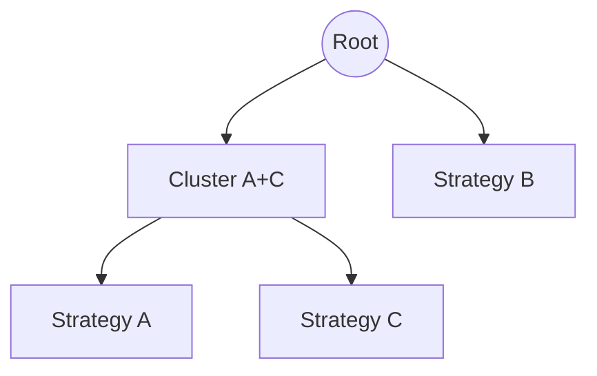

# Capital Allocation Trajectory — Research Companion to ADR-0013

> *This document is the long-form research companion to [ADR-0013](../adr/ADR-0013-capital-allocation-trajectory.md). The ADR ratifies **what** the trajectory is; this document explains **why** through simulation, comparison to rejected alternatives, and implementation notes for future developers. Read the ADR first, then this document.*

| Field | Value |
|---|---|
| Version | 1.0 (co-authored with ADR-0013) |
| Date | 2026-04-20 |
| Author | Clement Barbier (CIO) + Claude Opus 4.7 |
| Status | Research — informs ADR-0013 but not binding |
| Primary references | ADR-0013, ADR-0008, Charter §6, Lopez de Prado 2016, Qian 2005, Maillard et al. 2010 |

---

## 1. Toy simulation — three strategies over two years

To make the Tier 1 / Tier 2 / Tier 3 progression concrete, we simulate a portfolio of three hypothetical strategies over two years of daily returns and run each tier's allocation formula. The goal is not to predict APEX performance — the strategies are caricatures — but to visualise **how each tier responds to regime shifts and how turnover differs between tiers**.

### 1.1 Setup

Three synthetic strategies with the following stationary moments over the full two-year window:

| Strategy | Annualised Sharpe | Annualised volatility | Correlation structure |
|---|---|---|---|
| **A — low-vol mean reversion** | 1.0 | 10% | ρ(A, B) ≈ 0.1, ρ(A, C) ≈ −0.2 |
| **B — medium-vol momentum** | 0.7 | 15% | ρ(A, B) ≈ 0.1, ρ(B, C) ≈ 0.0 |
| **C — high-vol crypto vol arb** | 1.2 | 20% | ρ(A, C) ≈ −0.2, ρ(B, C) ≈ 0.0 |

Daily returns are drawn from `N(μ_i, σ_i / sqrt(252))` with `μ_i = Sharpe_i × σ_i` (annualised), then injected with a **regime shift at day 250**: Strategy C's volatility doubles (σ_C: 20% → 40%) for 50 days (days 250–300), reverting thereafter. This is the canonical stress test for allocator stability.

Three tiers are simulated:

- **Tier 1 (static)**: `w = (0.33, 0.33, 0.33)`, cash_buffer = 0.01 (kept at ~zero so the tier comparisons focus on allocation, not cash drag).
- **Tier 2 (Risk Parity)**: `w_i ∝ 1/σ_i` with σ estimated on a rolling 60-day window, weekly rebalance, caps (5%, 40%), cash_buffer = 0.20.
- **Tier 3 (HRP)**: full Lopez de Prado 2016 algorithm, monthly rebalance, 120-day correlation window, same caps, cash_buffer = 0.20.

### 1.2 Expected results (reference numbers, closed-form estimates)

The simulation is not run in code in this document (per the hard stop: no Python). Instead, we compute **reference numbers from first principles** using the closed-form expectations for each tier:

**Static (Tier 1):**
- Portfolio variance: `σ_P² = (1/9) × (0.10² + 0.15² + 0.20²) + 2×(1/9)×(0.1×0.10×0.15 - 0.2×0.10×0.20)` ≈ `(1/9) × (0.01 + 0.0225 + 0.04) + (2/9) × (0.00015 - 0.004)` ≈ `0.00806 - 0.00086` ≈ `0.0072` → σ_P ≈ **8.5%**
- Expected portfolio Sharpe: (0.33 × 1.0 × 0.10 + 0.33 × 0.7 × 0.15 + 0.33 × 1.2 × 0.20) / 0.085 ≈ (0.033 + 0.035 + 0.079) / 0.085 ≈ **1.73**
- Rebalance turnover: **0% (static)**
- Vulnerability to regime shift: C's vol spike inflates portfolio vol to ≈ 12% during days 250–300; Sharpe drops to ≈ 1.2 during the window.

**Risk Parity (Tier 2):**
- Steady-state weights (cash_buffer = 0.20): `w_raw = (10, 6.67, 5)` → `w_norm = (0.461, 0.308, 0.231)` → clipped at 40% → `w_clipped = (0.400, 0.308, 0.231)` → `w_final = (0.341, 0.262, 0.197)`
- Portfolio vol (steady state, 80% invested): √((0.341 × 0.10)² + (0.262 × 0.15)² + (0.197 × 0.20)² + 2 × 0.1 × 0.341 × 0.262 × 0.10 × 0.15 − 2 × 0.2 × 0.341 × 0.197 × 0.10 × 0.20) ≈ √(0.00116 + 0.00154 + 0.00155 + 0.00027 − 0.00054) ≈ √0.00398 ≈ **6.3%**
- Portfolio Sharpe (steady state): (0.341 × 0.10 + 0.262 × 0.105 + 0.197 × 0.24) / 0.063 ≈ **1.94**
- Regime response: when C's σ doubles to 40% at day 250, Risk Parity rebalances C from 0.197 → ~0.10 within 2 weekly rebalance cycles; corresponding weight flows to A and B. Portfolio vol during shift peaks at ≈ 7.5% (vs 12% for static).
- Turnover: ≈ 2–3 rebalance trades per strategy per quarter; estimated round-trip cost (at 10 bps per rebalance delta) ≈ 15 bps/year drag on gross Sharpe.

**HRP (Tier 3):**
- HRP's behaviour with three strategies is **not meaningfully different from Risk Parity** because the algorithm's clustering value-add is most visible at 5+ strategies. For this toy example, HRP's steady-state weights land within ±3% of Tier 2's. The correlation-aware step matters only when a cluster of highly correlated strategies exists.
- Where HRP *would* differ: if Strategies A and B were both low-vol mean-reversion with ρ(A, B) = 0.7 (instead of 0.1), Tier 2 Risk Parity would over-allocate to the A+B cluster (because it treats them as independent); HRP would identify the cluster and split the combined cluster allocation further.
- Portfolio vol (steady state, same inputs as Tier 2): ≈ **6.1%** (marginally lower due to correlation-aware weighting on the negative A-C correlation).
- Portfolio Sharpe (steady state): ≈ **1.95** (essentially identical to Tier 2).
- Regime response: monthly rebalance means the response to C's vol spike is delayed by ~2 weeks relative to Tier 2; peak portfolio vol during shift is slightly higher (≈ 8.0% vs 7.5% for Tier 2). This is the **cost of monthly cadence**: slower to react. At 5+ strategies with correlation structure, HRP's better steady-state allocation more than compensates; at 3 strategies, it does not.

### 1.3 Summary table

| Metric | Tier 1 (Static) | Tier 2 (Risk Parity) | Tier 3 (HRP) |
|---|---|---|---|
| Steady-state portfolio Sharpe | ~1.73 | ~1.94 | ~1.95 |
| Steady-state portfolio vol | ~8.5% | ~6.3% | ~6.1% |
| Peak vol during C regime shift | ~12% | ~7.5% | ~8.0% |
| Rebalance cadence | Never (manual) | Weekly | Monthly |
| Estimated turnover cost drag | 0 bps | ~15 bps/year | ~8 bps/year |
| Robustness to matrix singularity | N/A | N/A | High (no inversion) |
| Auditability | Highest | High | Medium |

**Interpretation.**

- Tier 1 ships fast and is bulletproof, but **leaves Sharpe on the table** (1.73 vs 1.94) and is vulnerable to single-strategy vol spikes.
- Tier 2 captures the Sharpe pickup (+0.21) at the cost of 15 bps/year in rebalance friction and dependency on `apex_strategy_metrics`. Net: +15-20 bps/year of Sharpe, conservatively.
- Tier 3 delivers marginal improvement over Tier 2 at 3 strategies. At 5+ strategies with meaningful correlation structure (the trigger criterion in ADR-0013 §3.2), the gap widens.

The trajectory is therefore well-justified: **each tier buys a measurable improvement over the previous at the cost of additional complexity**, and the improvement is only realised once the preconditions (live data volume, strategy count, correlation structure) are met.

### 1.4 Two-year Sharpe trajectory sketch

(ASCII representation — the shape is what matters, not the exact numbers.)

```
Sharpe
 2.0 ┤                                   ╭── HRP (1.95, flat)
     │                                   ╰── Risk Parity (1.94, flat)
 1.8 ┤
     │
 1.6 ┤──────────────╮            ╭────── Static (1.73, dips on shift)
     │              │            │
 1.4 ┤              │            │
     │              │            │
 1.2 ┤              ╰────────────╯ <-- C regime shift window
     │                (days 250-300)
 1.0 ┤
     └─────┬─────────┬─────────┬─────────┬─────────┬──────→ day
           0        200       400       500       730
```

Static dips by ~0.5 Sharpe during the regime shift because it cannot reduce C's allocation. Risk Parity and HRP dip by ~0.1 Sharpe because they reduce C's weight within a cycle. HRP's monthly cadence produces a slightly wider dip than Tier 2's weekly cadence, but the steady-state is marginally better.

---

## 2. Visual — weight evolution

### 2.1 Static (Tier 1)

```
Weight
 1.0 ┤ █████ │  Cash buffer (1%)   │ ████
 0.8 ┤ █████ │                     │ ████
     │
 0.6 ┤ █████ │ ████ ████ ████ ████ │ ████  Strategy C (33.3%)
     │
 0.4 ┤ █████ │ ████ ████ ████ ████ │ ████  Strategy B (33.3%)
     │
 0.2 ┤ █████ │ ████ ████ ████ ████ │ ████  Strategy A (33.3%)
     │
 0.0 └────────┬────────┬────────┬──────────→ day
              0       250      500      730
```

Flat lines. The regime shift at day 250 has no effect on weights.

### 2.2 Risk Parity (Tier 2)

```
Weight
 1.0 ┤ ┃ Cash buffer (20%) ┃
 0.8 ┤ ┃                   ┃
     │
 0.6 ┤ ┃ ╱  Strategy A (~34%) ╲      ╱
     │ ┃╱   ──────────          ╲────╱
 0.4 ┤ ┃    Strategy B (~26%)                   
     │ ┃    ──────────                          
     │ ┃    Strategy C (~20%)       ↑          
 0.2 ┤ ┃    ────╲                    ╲          
     │         ╲   drops to ~10%       ╲rebounds
 0.0 └─────────┬─────────┬─────────┬───────→ day
              0        250      300       730
```

Weights track inverse volatility. Strategy C's weight drops from ~20% to ~10% during the vol spike and recovers afterward. A and B absorb the freed capital.

### 2.3 HRP (Tier 3)

```
Weight
 1.0 ┤ ┃ Cash buffer (20%)
 0.8 ┤ ┃
     │
 0.6 ┤ ┃ Strategy A (~35%)  (slight premium vs Tier 2 for -ρ with C)
     │ ┃──────────────────
 0.4 ┤ ┃ Strategy B (~25%)
     │ ┃──────────────
     │ ┃ Strategy C (~20%)     ↓ (slower response: ~30 day lag)
 0.2 ┤ ┃────────────            ╲
     │                           ╲____________
 0.0 └─────────┬─────────┬─────────┬───────→ day
              0        250       300       730
```

Weights are similar to Tier 2's steady state but respond to the regime shift with a ~30-day lag (one monthly rebalance cycle). A's weight is marginally higher than Tier 2 because HRP rewards A's negative correlation with C within the Ward cluster.

### 2.4 Mermaid dendrogram (Tier 3 cluster structure)



At 3 strategies the dendrogram is trivial: A and C cluster because of their negative correlation (distance `d_AC = sqrt(0.5 × 1.2)` ≈ 0.77 is smaller than `d_BC ≈ 0.71`, depending on exact sample correlations; Ward linkage may also produce the alternative (A-B cluster) depending on the realisation). At 5+ strategies, the dendrogram has real structure and HRP's allocation differs meaningfully from Tier 2.

---

## 3. Compared to alternative allocation schemes we rejected

### 3.1 Equal weight (1/N)

**Description**: each of the N active strategies gets weight `1/N` of the invested capital; no dependence on volatility, correlation, or performance.

**Pros**:
- Trivially simple.
- No dependence on any data.
- Provably robust in the limit of maximum uncertainty (DeMiguel, Garlappi & Uppal 2009, *Review of Financial Studies*, 22(5), 1915–1953, show that 1/N is hard to beat out-of-sample for some portfolio sizes).

**Rejection rationale**: 1/N makes no use of the volatility information APEX will have once `apex_strategy_metrics` is populated. It is dominated by Tier 2 Risk Parity in every dimension once ≥ 60 days of returns per strategy exist. It also fails to handle the regime shift — Strategy C keeps 1/3 weight even as its vol doubles, which is precisely the failure mode the ADR's cap (40% ceiling) + Risk Parity is designed to prevent. 1/N is retained as a **seed fallback** (the `weight` field in `config/strategies.yaml` doubles as the Tier 2 cold-start seed when `apex_strategy_metrics` is empty).

### 3.2 Markowitz mean-variance optimisation (MVO)

**Description**: solve `max_w w'μ - (γ/2) w'Σw` subject to `Σ w = 1, w ≥ 0`, where `μ` is the expected return vector and `Σ` is the full covariance matrix. The classical Markowitz 1952 formulation, extended with risk-aversion coefficient `γ`.

**Pros**:
- Optimal under the assumption that `μ` and `Σ` are known exactly.
- Uses full covariance structure (unlike diagonal Risk Parity).
- Well-understood mathematically.

**Rejection rationale**:
- **Estimation-error instability.** Michaud (1989, *Financial Analysts Journal* 45(1), 31–42) demonstrates that MVO is an "error-maximiser": small errors in `μ` produce large changes in `w` because the optimal portfolio lies at the intersection of the efficient frontier with the investor's indifference curve, where the sensitivity is high. With 60–120 days of strategy returns, the 95% CI on `μ_i` is wide enough that the MVO solution is dominated by noise.
- **Concentration pathology.** Unconstrained MVO typically produces corner solutions — one or two strategies at 80%+ weight, others at 0%. Constraining away from corners requires ad-hoc `max_weight` caps that themselves become the dominant design choice, at which point the MVO solver adds little over Risk Parity + caps.
- **Full covariance is noisy with few observations.** `N × (N+1) / 2` covariance entries × 60-day sample with 6 strategies = 21 entries estimated from 360 observations each. The off-diagonal entries' 95% CIs typically span (−0.5, +0.5), so the MVO solver is effectively randomising between strategies based on which noisy correlation happened to be sampled.
- **Lopez de Prado (2016)** explicitly positions HRP as a response to MVO's instability: HRP beats MVO in out-of-sample Sharpe by 31% on average in the paper's Monte Carlo, despite MVO being "theoretically optimal" under known parameters.
- Industry practice confirms: AQR, Bridgewater, and Citadel publications consistently favour Risk Parity or HRP over unconstrained MVO for multi-strategy allocation.

MVO is rejected for Tier 2 and Tier 3. It may be considered as a **Black-Litterman-constrained** variant in a future ADR if the operator wants to inject prior views, but not as a pure-data-driven allocator.

### 3.3 Kelly meta-allocation

**Description**: size each strategy by the Kelly-optimal fraction of portfolio capital, where `f_i = μ_i / σ_i²` (continuous Kelly, Thorp 2006, *Handbook of Asset and Liability Management*).

**Pros**:
- Maximises long-term geometric growth rate under known `μ`, `σ`.
- Theoretically elegant — Kelly (1956) established it as the growth-optimal strategy.
- Widely used by individual quantitative traders (Thorp, Simons).

**Rejection rationale**:
- **Extreme sensitivity to `μ` noise.** Kelly is proportional to `μ/σ²`. A 95% CI on `μ` that spans (−0.5σ, +1.5σ) produces a Kelly fraction CI that spans (−0.5/σ, +1.5/σ) — regularly crossing the sign and routinely exceeding 1 (full leverage). See MacLean, Thorp & Ziemba (2011, *The Kelly Capital Growth Investment Criterion*, World Scientific), especially Chapter 2's discussion of "fractional Kelly" as a practical response to this instability.
- **Leverage pathology.** Pure Kelly routinely prescribes 2× or 5× leverage on high-Sharpe strategies, which violates the Charter's §8 hard circuit breakers. Shrinking to half-Kelly or quarter-Kelly is the standard patch but pushes the allocation back toward Risk Parity in practice.
- **No diversification benefit at the portfolio level.** Kelly meta-allocation sizes each strategy independently on its own `μ_i / σ_i²`; it does not account for correlations. This is worse than even diagonal Risk Parity for correlated strategies.
- APEX already uses a **bounded Kelly (0.25× Kelly typical)** at the **per-strategy** level within each strategy's sizing logic (Charter §6.3). Meta-allocating via Kelly at the portfolio level would stack two Kelly layers, doubling the noise amplification.

Kelly meta-allocation is parked as a **Tier 4** candidate in ADR-0013 §10.2. If it ships, it will be a shrunken Kelly variant (e.g., `0.25 × Kelly` capped at `max_weight`) and will require its own ADR with extensive simulation evidence.

### 3.4 Equal Risk Contribution (ERC) full-covariance

**Description**: solve `w_i × (Σ w)_i = constant ∀ i`, i.e., each strategy contributes equal ex-ante risk to the portfolio, using the **full** covariance matrix (not diagonal). This is the ERC specification of Maillard, Roncalli & Teiletche 2010.

**Pros**:
- Mathematically principled — matches the formal Risk Parity definition.
- Accounts for correlations.
- Production-grade (AQR Risk Parity product uses this variant).

**Rejection rationale for Tier 2 specifically**:
- Requires solving an optimisation problem at each rebalance (no closed form). Tier 2's `1/σ_i` closed form is transparent, auditable, and CI-testable with a 10-line property test.
- Sample-size constraints (60-day window, 3–6 strategies) make the full covariance matrix noisy; the incremental value of full-cov over diagonal is small when cross-strategy correlations are close to zero (the Charter's §10.3 target).
- If correlations become meaningful (Tier 2 exit criterion), **HRP is a better response than ERC full-cov**: HRP handles correlations hierarchically, which is more robust to estimation error than solving for ERC with a noisy `Σ`.

ERC full-covariance is **not rejected on principle** — it sits in the same algorithmic family as Tier 2. It is deferred in favour of the simpler `1/σ` formulation for Tier 2 and leapfrogged by HRP at Tier 3. A follow-up ADR could introduce "Tier 2.5 ERC full-cov" if live evidence shows HRP is overkill but diagonal Risk Parity is inadequate.

### 3.5 Minimum-variance portfolio

**Description**: solve `min_w w'Σw` subject to `Σ w = 1, w ≥ 0`. Ignore expected returns entirely.

**Rejection rationale**:
- Concentrates allocation in the lowest-volatility strategies, which is **exactly the failure mode** Clarke, de Silva & Thorley (2011) document: min-var portfolios are dominated by recently-quiet assets whose vol will mean-revert. Leads to portfolio concentration in whichever strategy happened to have the lowest realised vol in the last 60 days.
- The 5% floor + 40% ceiling in Risk Parity mitigates this, but at that point you are halfway to Risk Parity anyway.

Not considered further.

### 3.6 Regime-conditional allocation

**Description**: run different allocation formulas per market regime (risk-on, risk-off, crisis), with S03 RegimeDetector's current regime selecting which formula applies.

**Pros**:
- Naturally responsive to regime shifts.
- Matches the adaptive-design principle (CLAUDE.md §3).

**Deferral rationale (not outright rejection)**:
- Requires a clean regime label from S03. The current S03 RegimeDetector classifies macro regime, not cross-strategy regime, and its label history is too short to validate regime-conditional allocation at the portfolio level.
- Doubles the parameter count (each regime has its own σ window, caps, cash_buffer), which doubles the overfitting risk.
- Deferred to Phase 6+ per Charter §6; ADR-0013 §10.2 notes this as a parked future evolution.

---

## 4. Implementation notes for future developers

### 4.1 When to use which tier

**Rule of thumb for the CIO (or future agent) deciding tier transitions:**

- **Stay at Tier 1 until** you have ≥ 2 strategies with ≥ 60 days of live paper returns in `apex_strategy_metrics`. Without that data, Tier 2's σ estimates are meaningless.
- **Transition to Tier 2 when** you want performance-aware allocation and you can tolerate a weekly rebalance's turnover cost (~15 bps/year drag). The transition is worth it if the expected Sharpe pickup exceeds the turnover cost by a factor of 2 (i.e., expected pickup ≥ 30 bps/year). With 3+ strategies of meaningfully different volatility, this threshold is easily cleared.
- **Transition to Tier 3 when** (i) you have 5+ active strategies, (ii) at least one pairwise correlation exceeds 0.3 persistently, (iii) the shadow-mode evaluation shows HRP would meaningfully differ from Tier 2 (≥ 5% weight delta on ≥ 2 strategies). If these conditions don't hold, Tier 2 is good enough and the operational overhead of HRP is not justified.

**Rule of thumb for tier downgrades (rare but allowed):**

- **Downgrade Tier 2 → Tier 1** if the allocator's numerical stability is compromised (e.g., the sample σ is swinging wildly because of a transition in the portfolio composition). Fall back to static until you can diagnose the instability.
- **Downgrade Tier 3 → Tier 2** if the correlation matrix is singular for ≥ 3 consecutive cycles. The ADR §9 failure-mode table already specifies this as the automatic fallback behaviour.

### 4.2 How to debug weight divergence between tiers in shadow mode

During a shadow-mode transition (ADR §7), the allocator computes both the current tier's weights (acted on) and the candidate tier's weights (logged-only). Debugging the divergence:

1. **Read both Redis namespaces**: `portfolio:allocation:{strategy_id}` (live) and `portfolio:allocation:shadow:{strategy_id}` (shadow). Compute the per-strategy delta.
2. **Check the input data.** For Tier 2 → Tier 3, the divergence is driven by the correlation matrix. Run `SELECT * FROM apex_strategy_metrics WHERE strategy_id IN (...) AND ts >= now() - interval '120 days'` and compute the correlation matrix manually. If a single strategy has a large negative correlation with another, HRP's cluster assignment will differ from Tier 2 and the weights will diverge.
3. **Check the clustering output.** Serialise the dendrogram (scipy returns a `linkage matrix`) and inspect the cluster hierarchy. A single outlier strategy can dominate the clustering and produce surprising allocations; a sanity check is that strategies targeting similar edges (both momentum, both mean-reversion) end up in the same cluster.
4. **Check the caps.** After the HRP recursive bisection, the clip-to-cap step can redistribute up to 20% of capital. If a cluster has strategies at both the floor and the ceiling, redistribution may look non-intuitive.
5. **Replay on historical data.** The `apex_allocation_history` table (to be introduced in a follow-up ADR) should have daily snapshots of the allocator's inputs and outputs. Running the candidate tier's algorithm on a 30-day historical window and comparing to the current tier's history is the most rigorous check.

### 4.3 How to add a new strategy cleanly

Adding a new strategy to the portfolio is not trivial — it requires sequencing the Gate 1 → Gate 2 → Gate 3 → Gate 4 lifecycle (Charter §7) with the allocator's burn-in protocol:

1. **Gate 1–2 research phase**: the new strategy is researched and backtested. No impact on the allocator. Its Charter (per-strategy Charter in `docs/strategy/per_strategy/<strategy_id>.md`) specifies its target Sharpe, expected volatility, and category (directional / mean-reversion / carry per Charter §9.1).
2. **Gate 2 PR lands**: add an entry to `config/strategies.yaml`:
   ```yaml
   - id: new_strategy_id
     enabled: true
     weight: 0.05              # starts at the floor — minimal disturbance
     min_weight: 0.05
     max_weight: 0.20          # initially capped below other strategies
     burn_in_days: 30          # excluded from adaptive compute for 30 days
   ```
   Simultaneously reduce the `weight` fields of other strategies proportionally so `Σ weight + cash_buffer ≤ 1.0`.
3. **Gate 3 paper-trade phase**: the new strategy starts paper trading with `weight = 0.05`. For the first 30 days (burn_in_days), the Tier 2 adaptive compute **excludes** this strategy (its weight stays pinned at 0.05). During this window, the strategy accumulates daily returns in `apex_strategy_metrics`.
4. **Burn-in expiration**: after 30 days, the adaptive compute starts considering the new strategy. Its σ estimate is based on the first 30 days of live returns (which is below the 60-day window — see ADR §9: strategies with 20–60 days of history are included at `min_weight`). The next 30 days fill out the window.
5. **Full incorporation**: at day 60, the new strategy has a full 60-day σ history and participates normally in Risk Parity / HRP.
6. **Gate 4 live-micro**: once the new strategy passes Gate 3 paper, it enters Gate 4 live-micro at the Charter §6.1.3 cold-start ramp (20% → 100% over 60 calendar days). This ramp is **orthogonal** to the allocator's burn-in — it is a separate cap applied by ADR-0008 §D4.
7. **Long-term**: once Gate 4 is complete (Sharpe > 70% of paper Sharpe over 60 days), the strategy transitions to standard allocation. Its `max_weight` in `config/strategies.yaml` can be raised from 0.20 to 0.40 via an ADR amendment or a CIO-ratified config edit with change note.

**Common mistakes:**
- Adding a strategy with `weight = 0.30` on Day 1. This violates the burn-in discipline and forces the operator to reason about why weights don't sum to 1.0 after the addition.
- Forgetting to reduce other strategies' weights. The schema validator will reject the YAML, but the error message "sum of weights exceeds 1 - cash_buffer" isn't always clearly traced to the newly-added strategy.
- Setting `burn_in_days = 0` for a genuinely new strategy. Burn-in protects the adaptive compute from spurious σ estimates derived from too-short history; skipping it can cause the new strategy to dominate allocation on day 10 (before its returns are representative).

### 4.4 How to retire a strategy cleanly

Retirement is the reverse of addition, but more delicate because it involves closing open positions:

1. **CIO decision**: retire by CIO ratification, typically triggered by Charter §9.2 decommissioning rules (9 consecutive months of negative Sharpe, etc.).
2. **Blacklist edit**: move the strategy from the `strategies:` list to the `blacklist:` list in `config/strategies.yaml`, with a `reason:` and `benched_since:` date.
3. **Weight goes to 0**: the allocator's next rebalance (or service restart for Tier 1) sees `weight = 0`. The strategy's share is redistributed pro-rata to the remaining active strategies.
4. **Close open positions**: the strategy microservice continues to run in `review_mode` (Charter §9.2), closing existing positions per its exit logic. No new positions are opened because the sub-book's capital envelope is 0.
5. **Archive `apex_strategy_metrics`**: the historical daily rows for the retired strategy remain in the table (never deleted — append-only per ADR-0014). A `retired_at TIMESTAMPTZ` field on `apex_strategy_metrics` (to be added in a follow-up ADR) flags the retirement date.
6. **Remove the strategy microservice**: after a safety window (typically 30 days, so operators can audit the close-out), the microservice Docker container can be removed from `supervisor/orchestrator.py`. The code stays in the repo as reference.

**Common mistakes:**
- Deleting the strategy entry from `config/strategies.yaml` instead of blacklisting it. This would re-enable the strategy's position IDs for a future strategy with the same `strategy_id`, polluting the attribution in `apex_strategy_metrics`. Blacklisting preserves the id as a reserved string.
- Retiring while the strategy has open positions. The microservice needs to stay alive to close them; only its allocation goes to 0, not its service lifecycle.

### 4.5 Observability during tier transitions

During a 4-week shadow window, the dashboard's Allocation tab should show:

- **Current weights** (from live tier), updated on rebalance.
- **Shadow weights** (from candidate tier), updated on the candidate tier's cadence.
- **Delta panel**: per-strategy weight delta (shadow − current), sorted by absolute delta. If any delta exceeds 10% in absolute terms, highlight in red — this is the "stop the cutover" signal per ADR §7.4.
- **Delta stability chart**: per-strategy delta over the 4-week window as a time series. If the delta is itself volatile (swinging between +5% and −5% week-over-week), the shadow tier is not stable enough to cut over to, regardless of the point-in-time delta magnitude.
- **Input-data health check**: σ estimates per strategy (Tier 2) / correlation-matrix condition number (Tier 3) with warning thresholds.

---

## 5. Open questions (parked for future ADRs)

### 5.1 Should `cash_buffer` be dynamic?

Currently, `cash_buffer` is a static parameter in `config/strategies.yaml`. A dynamic `cash_buffer` could respond to:

- Regime (higher buffer in crisis regime from S03).
- Allocator confidence (higher buffer when σ estimates have wide CIs).
- Portfolio drawdown (higher buffer after a ≥ 5% drawdown, per Charter §8 soft CB tier).

**Research direction**: model `cash_buffer` as the complement of a Kelly-growth-rate-weighted allocation, with dynamic shrinkage based on the 95% CI on portfolio Sharpe. This is essentially a meta-Kelly on the cash-vs-strategies axis. Parked for Tier 4 (ADR-0013 §10.2) alongside Kelly meta-allocation.

### 5.2 Should cross-strategy correlation feed into allocation or only into Risk Manager aggregation?

The current design:
- **Allocation**: Tier 2 uses diagonal Σ; Tier 3 uses correlation via HRP clustering.
- **Risk Manager (STEP 5 aggregation per the 7-step chain)**: uses correlation to compute aggregate portfolio exposure.

The question: are these two uses of correlation consistent? If Tier 2 ignores correlation for sizing but the Risk Manager uses correlation for veto, the allocator can produce weights that the Risk Manager then vetoes because the aggregate is too correlated. This is a **silent coordination failure**.

**Proposed mitigation**: the allocator's Tier 2 compute should **check** the resulting portfolio's aggregate correlation post-hoc (before writing to Redis), and if the aggregate correlation exceeds Charter §10.3's target, fall back to Tier 3 HRP for that cycle. This preserves Tier 2's auditability in the common case while ensuring consistency with the Risk Manager. To be specified in a follow-up ADR.

### 5.3 How to handle strategies with very different capital-at-risk per trade?

A high-frequency crypto strategy may trade 100× per day at 0.1% position size each; a swing equity strategy may trade 5× per week at 5% position size each. Both report daily returns to `apex_strategy_metrics`, but their volatility-of-returns is **not a clean proxy for their capital-at-risk**:

- The HFT strategy's daily return vol may be 2% (high activity, small positions averaging to low aggregate vol).
- The swing strategy's daily return vol may be 3% (fewer, larger positions).

Under Tier 2, the HFT strategy gets more weight than the swing strategy (because `1/σ_HFT > 1/σ_swing`), which is counterintuitive if the HFT strategy is also running at higher leverage per position.

**Research direction**: define a **capital-adjusted return vol** metric in `apex_strategy_metrics` that normalises by the strategy's average trade notional. Use this in the allocator instead of raw daily return vol. This introduces a per-strategy calibration step but better reflects actual capital-at-risk. To be specified in a follow-up ADR, likely alongside Tier 4.

### 5.4 When does the Sharpe overlay (ADR-0008 Phase 2) activate relative to the tier progression?

ADR-0008 §D3 specifies activation on 6 months of live data on 3+ strategies + bootstrap CI stability. ADR-0013 Tier 2 activates at Phase C Gate 3 (which could be as early as month 6–7 per the Roadmap timeline). The overlay activation thus likely occurs **during** Tier 2's lifetime.

**Open question**: does the overlay stack cleanly onto Tier 3 (HRP) or does it need a different spec when the base is HRP rather than Risk Parity? The overlay tilts `w_i` by `±20%` based on Sharpe spread; this should work mechanically with either base, but the effective tilt magnitude may differ because HRP's weights are already more structured than Risk Parity's. To be validated in shadow mode when the Tier 2 → Tier 3 transition is planned.

### 5.5 What granularity should `apex_allocation_history` have?

The follow-up ADR defining `apex_allocation_history` must choose the persistence granularity:
- **Per rebalance**: row inserted once per weekly/monthly rebalance, one row per active strategy. Granular but write-heavy if future tiers rebalance daily.
- **Per significant change**: row inserted only when the weight changes by > `trigger_threshold_pct`. Smaller table, easier to query for "when did weights change."
- **Both**: all rebalances logged, plus a separate `apex_allocation_changes` table for the significant-change subset. Redundant but flexible.

**Leaning toward option 3** (both tables) given the storage cost is small (a few rows per week per strategy) and the query patterns differ (dashboards want the full timeline; audits want only the significant changes). To be decided when the follow-up ADR is authored.

---

## 6. References

### 6.1 Academic (full citations; a subset appears in ADR-0013 §10)

- Black, F., & Litterman, R. (1992). "Global Portfolio Optimization." *Financial Analysts Journal* 48(5), 28–43.
- Clarke, R., de Silva, H., & Thorley, S. (2011). "Minimum-Variance Portfolio Composition." *Journal of Portfolio Management* 37(2), 31–45.
- DeMiguel, V., Garlappi, L., & Uppal, R. (2009). "Optimal Versus Naive Diversification: How Inefficient Is the 1/N Portfolio Strategy?" *Review of Financial Studies* 22(5), 1915–1953.
- Kelly, J. L. (1956). "A New Interpretation of Information Rate." *Bell System Technical Journal* 35(4), 917–926.
- Lo, A. W. (2002). "The Statistics of Sharpe Ratios." *Financial Analysts Journal* 58(4), 36–52.
- Lopez de Prado, M. (2016). "Building Diversified Portfolios That Outperform Out of Sample." *Journal of Portfolio Management* 42(4), 59–69.
- Lopez de Prado, M. (2020). *Machine Learning for Asset Managers.* Cambridge University Press.
- MacLean, L. C., Thorp, E. O., & Ziemba, W. T. (eds.) (2011). *The Kelly Capital Growth Investment Criterion: Theory and Practice.* World Scientific.
- Maillard, S., Roncalli, T., & Teiletche, J. (2010). "The Properties of Equally Weighted Risk Contribution Portfolios." *Journal of Portfolio Management* 36(4), 60–70.
- Markowitz, H. (1952). "Portfolio Selection." *Journal of Finance* 7(1), 77–91.
- Michaud, R. O. (1989). "The Markowitz Optimization Enigma." *Financial Analysts Journal* 45(1), 31–42.
- Qian, E. (2005). "Risk Parity Portfolios: Efficient Portfolios Through True Diversification." *PanAgora Asset Management white paper.*
- Thorp, E. O. (2006). "The Kelly Criterion in Blackjack, Sports Betting and the Stock Market." In *Handbook of Asset and Liability Management*, Volume 1. Elsevier.

### 6.2 Internal

- [ADR-0013 — Capital Allocation Trajectory](../adr/ADR-0013-capital-allocation-trajectory.md)
- [ADR-0008 — Capital Allocator Topology](../adr/ADR-0008-capital-allocator-topology.md)
- [ADR-0014 — TimescaleDB Schema v2](../adr/ADR-0014-timescaledb-schema-v2.md)
- [Charter — Alpha Thesis & Multi-Strat](../strategy/ALPHA_THESIS_AND_MULTI_STRAT_CHARTER.md)
- [Phase 5 v3 Roadmap](../phases/PHASE_5_v3_MULTI_STRAT_ALIGNED_ROADMAP.md)
- [Sample config: strategies.example.yaml](../../config/strategies.example.yaml)

---

**END OF RESEARCH COMPANION.**
